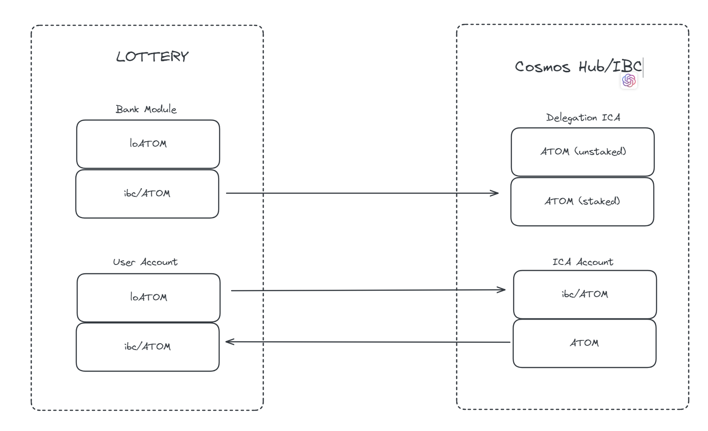
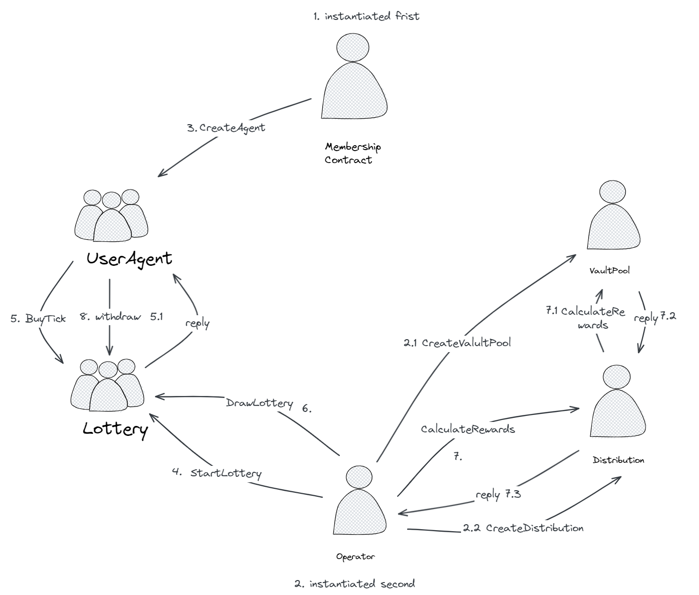

# Lottery

`Lottery` 是一个集合 **流动性质押衍生品(LSD, Liquid Staking Derivatives)** 和 **彩票** 功能的应用链，用户在Lottery上可以质押ATOM或其他Cosmos应用链token，得到ltATOM，用户可以把ltATOM在defi平台交易，也可以用ltATOM在Lottery上进行投注，以获得可能的奖励。

`Lottery` 同时发行同名 Token `LOTTERY` ，供应量是1亿，其中团队占 20%， 空投 5%， 私募: 10%, 公募： 15%，社区 40%， 国库 10%

每年增发 20%，其中25%分配给矿工，50% 分配作彩票奖金池，25% 分配给质押者

消耗：购买 彩票，每注 `100 LOTTERY`

## LSD

## Lottery

### Description

#### **彩票** 资格：

`ltATOM` 持有者

#### **彩票** 规则：

奖金来源：平台增发的 Token `LOTTERY` 
权重：与 用户一年内参与次数 和 `lsATOM` 数量有关，公式 `TBD`
中奖：按权重在所有参与者中随机选出一个

#### **彩票** 玩法：

定期开奖，例如 20：00开奖（可通过Oracle，尽量自动，手动备选）
每天一次，中奖者获得90%的奖励，10%进入年度终极大奖奖金池
每年12-31 22:00年底终极大奖开奖，中奖者获得全部奖金（或者分1，2，3名）

### Use Cases

#### Start game 平台开始新一轮

每一轮彩票开售时间是每天的00点，开始后接受投注，可以由Oracle自动触发

#### Place a ticket 用户投注

`ltATOM` 持有者通过在投注入口参与 **彩票** 活动。

用户可以投注当前正在进行的彩票，每张 `100 LOTTERY`，每个用户每轮限制 1 注，用户投注成功后，获取一个nft彩票凭证，用于兑奖，也可交易。

#### Close game 当前轮次结束

结束当前进行的彩票，结束后不再接受投注

#### Calculate Prize 计算奖金

`TBD`

#### Choose winner 开奖

通过规则选出中奖的 nft

#### Winner withdraw 中奖者兑奖

中奖者使用投注时的彩票凭证 nft 进行兑奖, 领取全部的 `LOTTERY` 奖金

#### Query lottery 查看指定的某一个期 

可查询彩票投注情况，包括总金额，参与人数，获奖者（如果开奖了）

### System Design

#### Actor （合约）

Membership：用户注册表

UserAgent：用户代理,每个用户专用，简单版智能合约钱包

Operator: 彩票运营（未来可能由Oracle自动触发）

Lottery：彩票，每轮一个，开奖后生成一个新的合约

PrizePool：奖金池 （计算奖金）

Distribution: 奖金分配 

#### Flow Diagram

